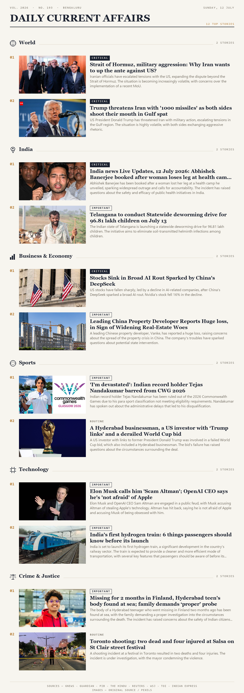

# Daily Current Affairs Digest Agent

An autonomous news aggregation pipeline that collects, classifies, summarizes, and visualizes daily news — built from scratch as a first-year CS student project to explore agentic AI, API integration, and automated content generation.

Every run, this project:

1. **Collects** news from 8 sources (GNews, The Guardian, PIB, The Hindu, Reuters, The Wall Street Journal, The Times of India, The Indian Express)
2. **Classifies** each story using an LLM (Groq / Llama 3.3 70B) into one of six sections — World, India, Business & Economy, Sports, Technology, Crime & Justice — and rates its importance (Critical / Important / Routine)
3. **Summarizes** each story into a short, neutral explanation
4. **Generates two newspaper-style posters** as PNG images:
   - **Important Digest** — top stories per section, each with a real photo and explanation
   - **Full Digest** — every story collected, organized by section, text-only
5. **Sends an email alert** if any story is rated Critical
6. **Runs automatically every evening** via Windows Task Scheduler

## Why this project

I wanted to understand how "agentic AI" actually works in practice — not just calling an LLM once, but chaining multiple steps together (fetch → classify → summarize → visualize → notify) where each step's output feeds the next, with the AI making real judgment calls (what's important, what category something belongs to) rather than just reformatting text.

## Screenshot




## Tech Stack

| Component | Tool |
|---|---|
| News collection | `requests`, `feedparser` (RSS) |
| AI classification & summarization | Groq API (Llama 3.3 70B) |
| Poster image generation | Pillow (PIL) |
| Story images | Original source images + Pexels API (fallback) |
| Email notifications | Gmail SMTP |
| Scheduling | Windows Task Scheduler |

## Project Structure

```
news_agent/
├── main.py                  # Orchestrates the full pipeline
├── config.py                 # Central config (reads API keys from .env)
├── summarizer.py              # AI classification + summarization (Groq)
├── poster_generator.py        # Generates both poster images
├── image_fetcher.py            # Fetches/downloads story images
├── notifier.py                 # Email alerts for Critical news
├── fetchers/
│   ├── gnews_fetcher.py
│   ├── guardian_fetcher.py
│   ├── pib_fetcher.py
│   ├── hindu_fetcher.py
│   ├── reuters_fetcher.py
│   ├── wsj_fetcher.py
│   ├── toi_fetcher.py
│   └── indianexpress_fetcher.py
├── requirements.txt
└── .env.example              # Template for your own API keys
```

## Setup

### 1. Clone the repo
```bash
git clone https://github.com/PavanCodeNexus/news-digest-agent.git
cd news-digest-agent
```

### 2. Install dependencies
```bash
pip install -r requirements.txt
```

### 3. Get your free API keys
- **GNews**: [gnews.io](https://gnews.io)
- **The Guardian**: [open-platform.theguardian.com/access](https://open-platform.theguardian.com/access)
- **Groq** (free, no card): [console.groq.com](https://console.groq.com)
- **Pexels** (free): [pexels.com/api](https://www.pexels.com/api/)
- **Gmail App Password**: [myaccount.google.com/apppasswords](https://myaccount.google.com/apppasswords) (requires 2-Step Verification enabled)

### 4. Configure environment variables
```bash
cp .env.example .env
```
Then fill in your actual keys in `.env`.

### 5. Run it
```bash
python main.py
```

Two poster PNGs will appear in a `posters/` folder, and you'll get an email if any Critical news is found.

## Roadmap / Possible Improvements

- [ ] Instagram auto-posting (requires Business account + image hosting)
- [ ] Web dashboard instead of static images
- [ ] Historical archive / searchable past digests
- [ ] Multi-language summaries

## Author

Pavan B C — First-year CS Engineering student, DSATM, Bengaluru
